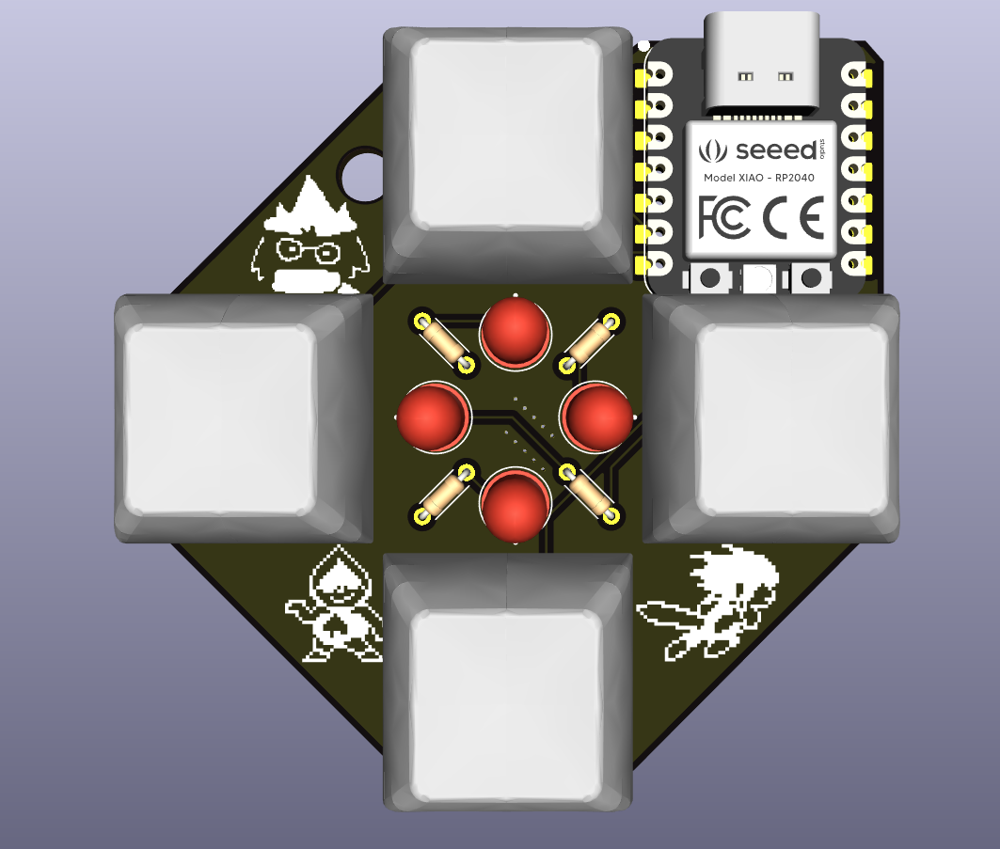
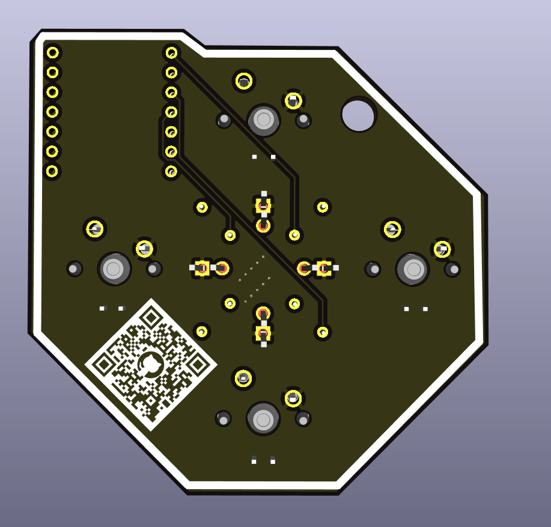
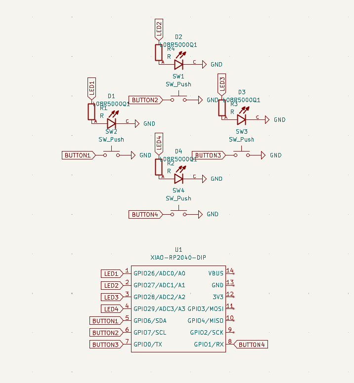
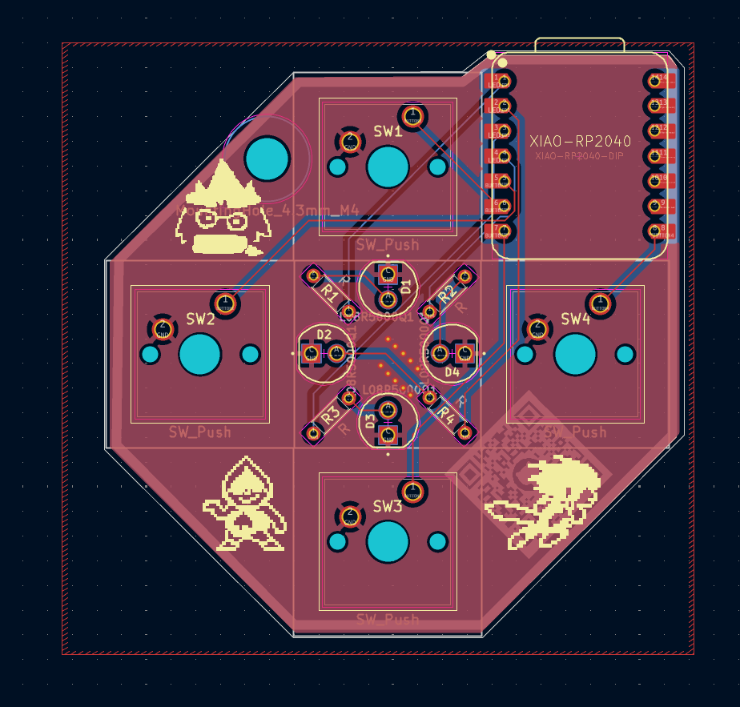

# thingamajig

A board with 4 buttons and 4 leds that cycles through each led. When one or more buttons are pressed, only the specific leds corresponding to the pressed buttons are lit.

## Images

| Image                                                          | Description |
| -------------------------------------------------------------- | ----------- |
|           | PCB Front   |
|             | PCB Back    |
|         | Schematic   |
|  | PCB Design  |

---

Made for https://pathfinder.hackclub.com/